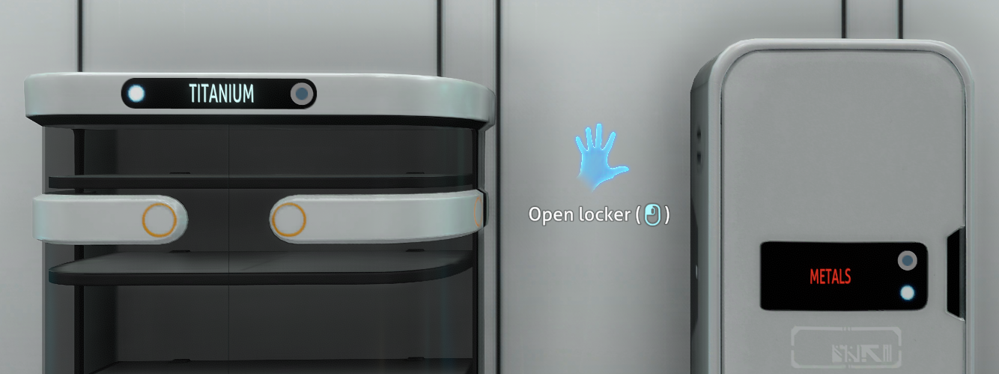
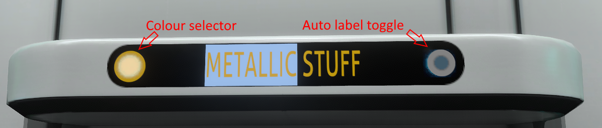
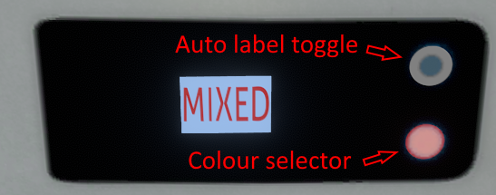
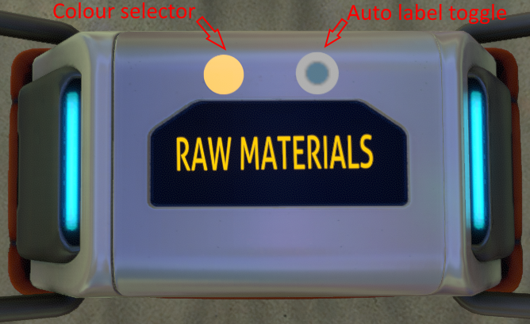
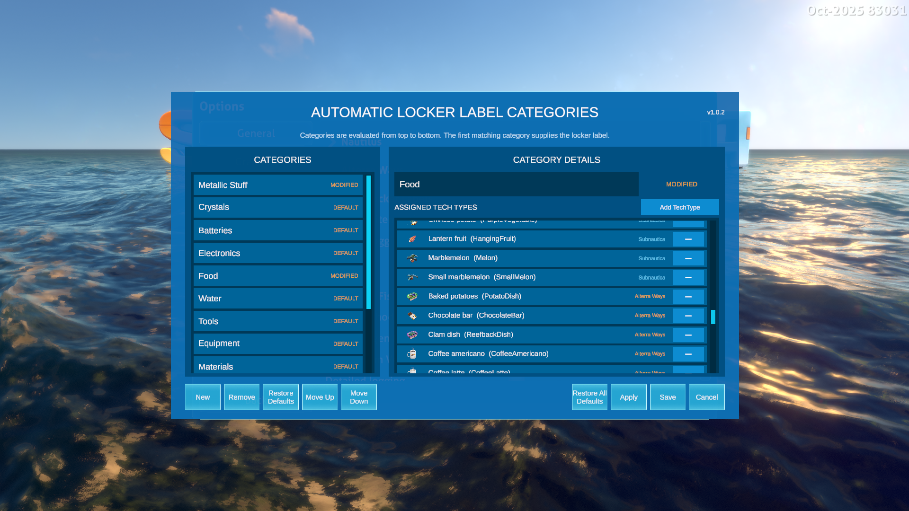
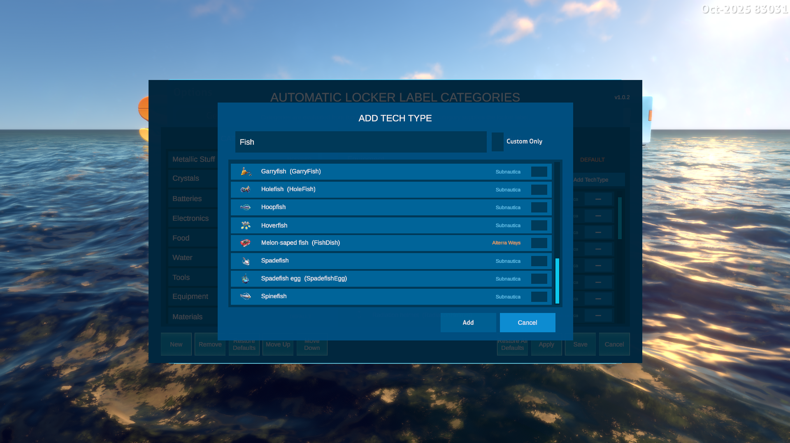

# **Auto Locker Labels**

This mod automatically generates locker labels based on the items stored within. For example:

- All 'Copper' items - the locker label will be 'COPPER'.
- 'Copper' and 'Titanium' items - the locker label will be 'METALS'.
- 'Coffee' and 'Hoopfish' - the locker label will be 'FOOD'.
- Lots of different items - the locker label will be 'MIXED'.
- Details of all the categories and item mappings can be found in [this document](https://github.com/mroshaw/SubnauticaThunderKitMods/blob/main/Assets/Mods/AutoLockerLabels_SN/CATEGORIES.md).

To ensure you get the most out of this functionality, the mod also adds a customisable label to the larger, freestanding locker, with equivalent UI controls, including the colour selector from the small locker.

Auto labelling is available on:

- Large freestanding lockers.
- Wall lockers.
- Waterproof lockers

## Features

The mod adds these new features:

- Customisable labels on freestanding lockers that work in the same way as the wall lockers.
- A new toggle button within the existing locker UI to toggle automatic labelling mode.
- Labels and toggling are persisted across saves.
- Categories and mappings to items are fully customisable, supporting 3rd party mod added items.
- A mod option to tweak how the automatic naming works.

## User Guide

Interact with a locker label as you would normally. Use the new toggle control to toggle automatic labelling on or off.

### Large locker

### Wall locker

### Waterproof locker

You can view, amend, add and remove categories and mapping of categories to items via the Options > Mods menu. Under the "Auto Locker Label" heading, you'll see a "Configure Categories" button. Click this to access the customisation UI:

The UI itself is self-explanatory, but do create a post if you're unsure. When clicking the "Add TechType" button to add items to a category, you can use the "Custom Only" checkbox to show items added by other mods:

This makes it really easy to categorise custom items, such as "Food" items from the excellent [AlterraWays](https://www.nexusmods.com/subnautica/mods/1516) mod.

## Options

Go into Options > Mods where you can tweak some settings:

- **Dominant item ratio** - if the percentage of a single item in a locker exceeds this threshold, then the locker will be labelled according to that single item. So, if this value is 90, if 'Titanium' represents 90% or more of a locker's contents, it will be labelled 'Titanium'. This is to prevent the accidental addition of one or two items that might force the label to 'Mixed'.
- **Detailed logging** - Only enable this if you have an issue and want to provide useful logging when reporting a bug.
- **Configure Categories** - See the explanation above.

## Installation and Dependencies

> ***IMPORTANT!** This mod uses **BepInEx** and **Nautilus**. You **must** install the latest versions of these to use this mod. As the 2025 patch broke a lot of mods, you must use **Nautilus version 1.0.0-pre.50** or later.*

## Source Code

All of my mods are open source, and you can find the full source code in my [Subnautica Mods GitHub Repository](https://github.com/mroshaw/SubnauticaThunderKitMods).

## Attribution

Thank you to Discord user "**.epanastatis.**" for the idea! Here's the original idea info:

> **Suggestion #3436**
> Automatic locker labels. Place items in standing or wall lockers, and the label is automatically populated for you based on the contents. Could handle specific items (E.g. copper ore would set the locker label to Copper or Cu) and varieties of items (E.g. titanium and copper ore would set the locker label to Metals or Ore)