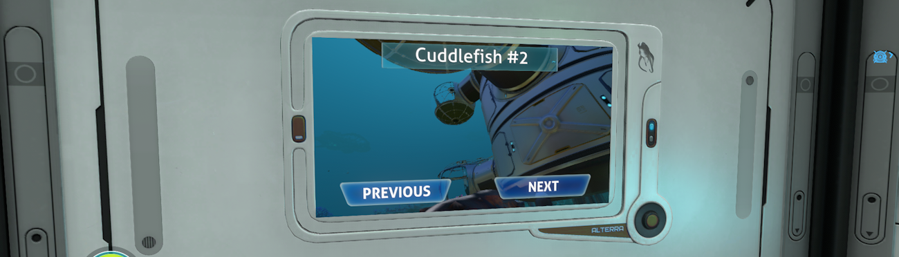

# Welcome to CuddleCam!

Have you ever wondered what your Cuddlefish gets up to when you're sitting all cosy and comfortable in your base? Well, wonder no more, thanks to CuddleCam, the amazing new home entertainment product from Alterra!

## Features

With the new CuddleCam from Alterra, you now have access to several great features:

- Adds a new constructible item in 'Miscellaneous', the 'CuddleCam Monitor'!
- Cycle through live feeds from all active Cuddlefish.
- Follow a different Cuddlefish on any number of monitors.
- Lots of Mod Options for tweaking and managing performance.

## Options

Go into Options > Mods where you can tweak some settings:

- **Feed refresh rate** - the higher the number, the smoother the video feed, but the greater the performance cost,
- **Feed quality** - higher resolutions look better but reduce performance.
- **Pause distant monitors** - Improves performance by pausing monitors that are far away.
- **Pause off-screen monitors** - Improves performance by pausing monitors not visible to the player.
- **Underwater effects** - looks cool but can be turned off to improve performance.
- **Detailed logging** - Only enable this if you have an issue and want to provide useful logging when reporting a bug.

## Installation and Dependencies

> ***IMPORTANT!** This mod uses **BepInEx** and **Nautilus**. You **must** install the latest versions of these to use this mod. As the 2025 patch broke a lot of mods, you must use **Nautilus version 1.0.0-pre.50** or later.*

## Source Code

All of my mods are open source, and you can find the full source code in my [Subnautica Mods GitHub Repository](https://github.com/mroshaw/SubnauticaThunderKitMods).