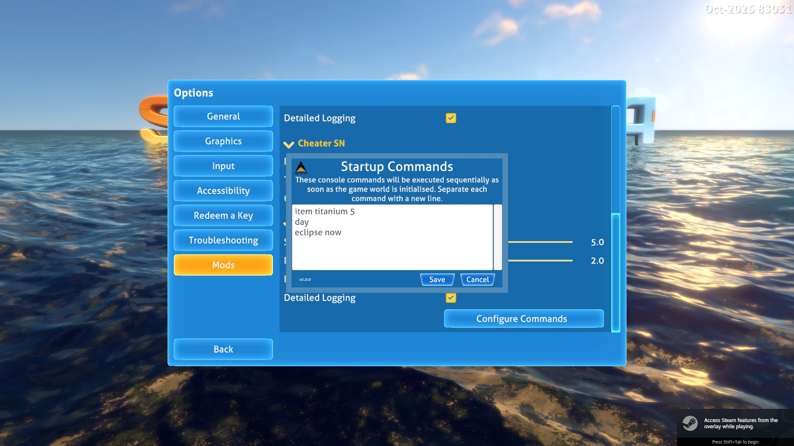

# **Startup Commands SN**

This mod allows you to configure a list of console commands that will be executed every time the game is started or a game is loaded.

## User Guide

Set the command list via Options > Mods, separating each command with a new line:



With the example above, every time you start or load a game, you'll get 5 titanium added to your inventory, the time of day will be set to day and, if you have the Aqua Eclipse Now SN mod enabled, time will be accelerated to a solar eclipse event.

## Options

You can configure some additional parameters via the mod options:

- **Start Delay** - The number of seconds after the Player is initialised before the commands are executed.Delay Between Commands - The number of seconds to wait between executing each command.Disable Alerts - You can check this to suppress the alerts that are displayed when commands are executed. Details will still be written to the Player log

You can find a list of supported console commands on this [Subnautica Fandom Wiki page](https://subnautica.fandom.com/wiki/Console_Commands_(Subnautica)).

For example, you could use this list to cheat:

```
fastbuild
fastgrow
fasthatch
fastscan
fastswim
noblueprints
nodamage
oxygen
```

Also available for Below Zero!

## Installation and Dependencies

> ***IMPORTANT!** This mod uses **BepInEx** and **Nautilus**. You **must** install the latest versions of these to use this mod. As the 2025 patch broke a lot of mods, you must use **Nautilus version 1.0.0-pre.50** or later.*

## Source Code

All of my mods are open source, and you can find the full source code in my [Subnautica Mods GitHub Repository](https://github.com/mroshaw/SubnauticaThunderKitMods).